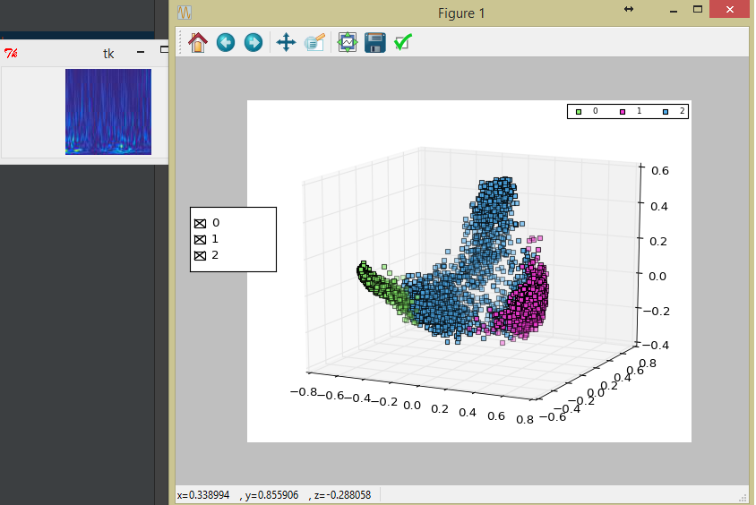

# Pca3D
Little script to show pca3D with images when you click on a point.

# Installation
Inside this folder.

```sh
pip install -r requirements.txt
```

# How to use

```sh
python plot3d.py path/to/pickle.pkl
```
Included an example pkl without images. To select a point just click and it should show the asociated image in the Tkinter window.

# Pickle format
[x, y, listF, nLabels,imageFolder] = pickle.load(file)

* x is a numpy array with shape [n,3] generated by a PCA transform of 3 components.
* y is a numpy array with shape [n,1] with the labels of the points.
* listF is a array with the names of the images corresponding to each point.
* imageFolder is the folder where those images are stored. The image should be accesible by concatenating path(imageFolder,listF). So the image folder should be moves inside this project


